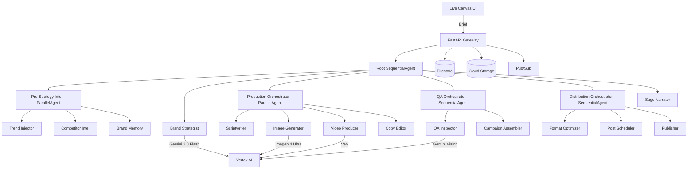

# BrandForge

**AI-Powered Multi-Agent Marketing Platform** — An autonomous creative director that builds complete, brand-coherent marketing campaigns from a single text or voice brief.

## What It Does

BrandForge deploys 11 specialized AI agents in a 6-stage pipeline to transform a simple brand description into a full marketing campaign:

1. **Intelligence Gathering** — Trend Injector, Competitor Intel, and Brand Memory agents research the market landscape in parallel
2. **Brand Strategy** — Brand Strategist synthesizes research into a comprehensive Brand DNA document (colors, typography, tone, personas, messaging pillars)
3. **Creative Production** — Scriptwriter, Image Generator (Imagen 4 Ultra), Video Producer (Veo), and Copy Editor create platform-specific assets with A/B/C variants
4. **Quality Assurance** — QA Inspector uses Gemini Vision to verify every asset against Brand DNA; failed assets are automatically regenerated with correction prompts
5. **Distribution** — Format Optimizer, Post Scheduler, and Publisher prepare and schedule posts across platforms via MCP
6. **Narration** — Sage provides voice-interactive campaign debriefing with real-time TTS

## Architecture



## Tech Stack

| Component | Technology |
|-----------|-----------|
| Agent Framework | Google ADK (Agent Development Kit) |
| LLM | Gemini 2.0 Flash (all agents) |
| Image Generation | Imagen 4 Ultra |
| Video Generation | Veo |
| Text-to-Speech | Cloud TTS |
| Hosting | Cloud Run |
| Database | Firestore (Native mode) |
| Object Storage | Cloud Storage |
| Messaging | Pub/Sub |
| Social Posting | MCP Protocol |
| Scheduling | Cloud Scheduler |
| Frontend | React + Zustand + Tailwind + Framer Motion |
| Schema Validation | Pydantic v2 |
| Package Manager | uv |

## Setup & Deploy

### Prerequisites
- Python 3.11
- Node.js 18+
- Google Cloud SDK (`gcloud`)
- [uv](https://github.com/astral-sh/uv) package manager

### Local Development

```bash
# Clone and install
git clone <repo-url> && cd brandforge
uv sync

# Set up GCP
./scripts/bootstrap.sh
./scripts/seed_secrets.sh

# Run backend
uvicorn brandforge.api:app --reload --port 8080

# Run frontend
cd frontend && npm install && npm run dev
```

### Deploy to Cloud Run

```bash
gcloud builds submit --config cloudbuild.yaml
```

### Demo Mode

Visit `http://localhost:3000?demo=true` to auto-launch a pre-scripted demo with the "Grounded" sustainable sneakers brand. The demo includes:
- Full 11-agent pipeline execution
- Engineered QA failure + automatic recovery
- A/B variant showcase with scoring
- Live infrastructure status panel

## Demo Video

[Link to demo video — placeholder]

## Hackathon

- **Category:** Creative Storyteller
- **Project ID:** brandforge-489114
- **Live Demo:** [URL — placeholder]

## License

MIT
