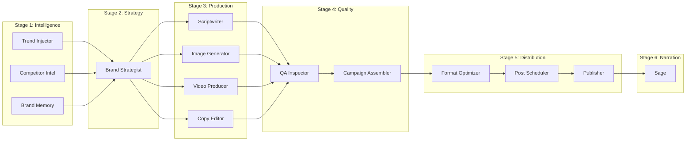

# BrandForge Architecture

## Pipeline Overview

BrandForge uses Google ADK's `SequentialAgent` and `ParallelAgent` primitives to orchestrate 11 specialized AI agents in a 6-stage pipeline.

## Data Flow

1. **User submits brand brief** via the Live Canvas UI (React SPA)
2. **FastAPI gateway** creates a Campaign document in Firestore and triggers the ADK pipeline
3. **Pre-Strategy Intel** (ParallelAgent) runs three agents simultaneously:
   - **Trend Injector** uses Google Search to find real-time cultural/platform trends
   - **Competitor Intel** uses Playwright to screenshot competitor websites and Gemini Vision to analyze their visual language
   - **Brand Memory** retrieves historical campaign data from Firestore for returning brands
4. **Brand Strategist** synthesizes all intelligence into a **Brand DNA** document — the single source of truth for colors, typography, tone, personas, and messaging pillars
5. **Production Orchestrator** (ParallelAgent) runs four creative agents:
   - **Scriptwriter** produces platform-optimized video scripts (15s/30s/60s)
   - **Image Generator** creates campaign images via Imagen 4 Ultra with 3 A/B/C variants per platform spec
   - **Video Producer** generates videos via Veo and composites voiceover via Cloud TTS + FFmpeg
   - **Copy Editor** writes platform-specific captions, headlines, hashtags, and CTAs
6. **QA Inspector** uses Gemini Vision to score every asset against Brand DNA (color compliance, tone, visual energy). Assets scoring below 0.80 receive a correction prompt and are regenerated automatically.
7. **Campaign Assembler** packages all approved assets into a ZIP bundle with a brand kit PDF
8. **Distribution pipeline** optimizes formats, schedules posts at optimal times, and publishes via MCP
9. **Sage** provides a voice-interactive campaign debrief narration

## Key Design Decisions

- **ADK-native orchestration**: All agent coordination uses ADK primitives (`SequentialAgent`, `ParallelAgent`, `LoopAgent`) rather than custom orchestration code
- **Session state as bus**: Agents communicate via ADK session state and `output_key`, avoiding direct coupling
- **Firestore as event source**: The frontend subscribes to Firestore `onSnapshot` listeners for real-time updates
- **QA loop with auto-recovery**: The QA Inspector generates correction prompts that are fed back to production agents for regeneration, creating a self-improving quality loop
- **Brand Memory for iteration**: Each campaign's performance data is stored and used to improve subsequent campaigns for the same brand

## GCP Services Used

| Service | Purpose |
|---------|---------|
| Cloud Run | API + agent hosting |
| Firestore | Campaign state, Brand DNA, QA results, analytics |
| Cloud Storage | Generated images, videos, bundles, PDFs |
| Vertex AI | Gemini 2.0 Flash, Imagen 4 Ultra, Veo |
| Cloud TTS | Video voiceovers, Sage narration |
| Pub/Sub | External event triggers (campaign.created, campaign.published) |
| Cloud Scheduler | Automated post scheduling |
| Secret Manager | API keys and credentials |
| Cloud Monitoring | Infrastructure status panel |
